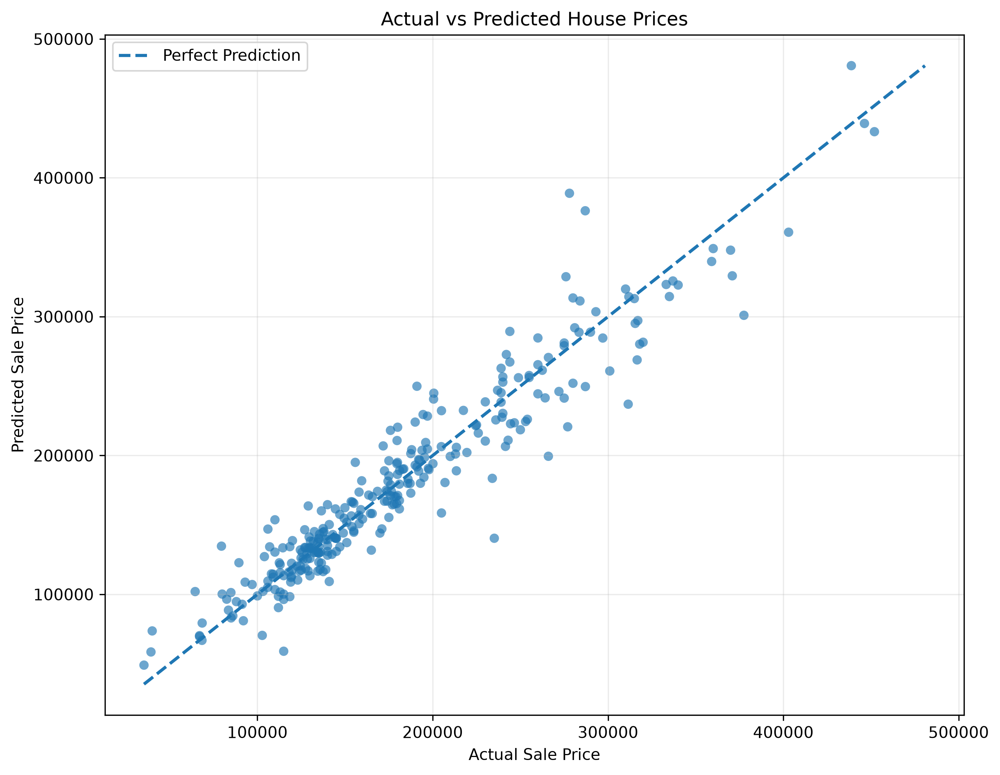
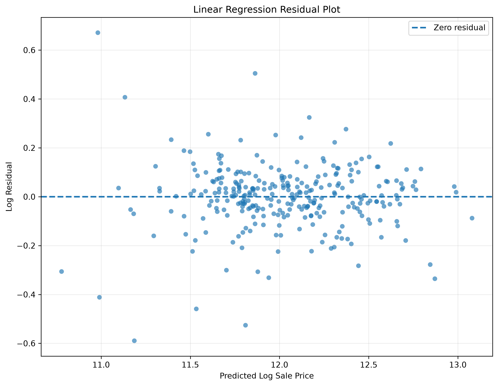
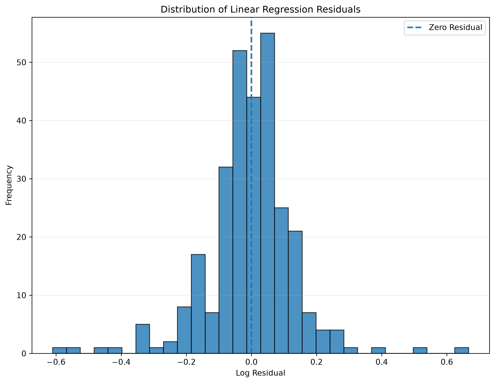
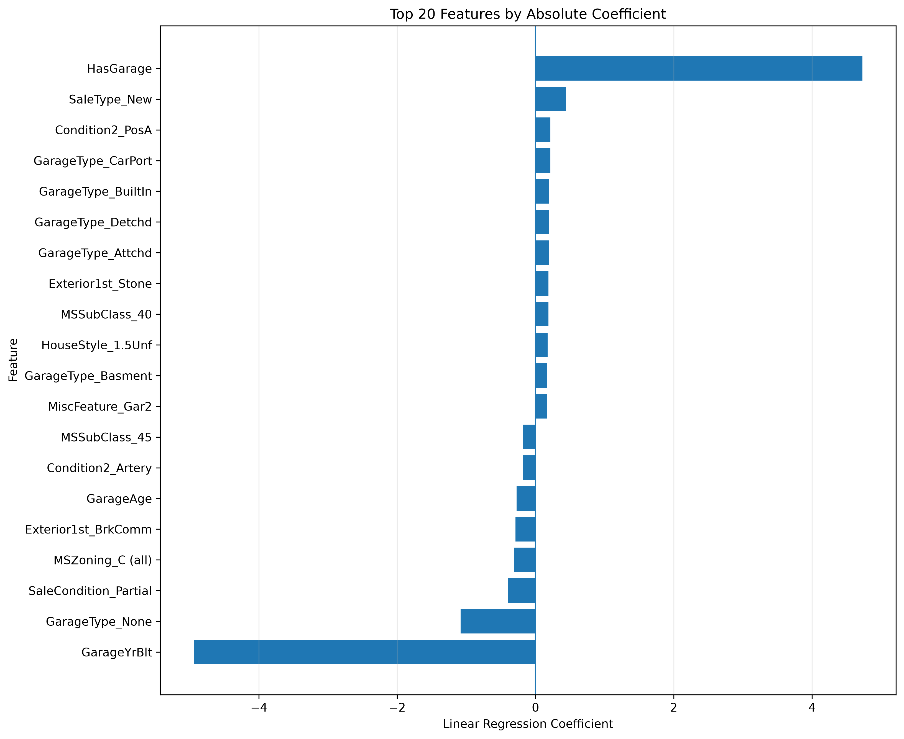

# House Price Prediction using Machine Learning


An end-to-end Machine Learning project that predicts residential house prices using the **Ames Housing Dataset**. The project includes a complete preprocessing pipeline, feature engineering, Linear Regression training, evaluation, and visualization.

---

# Project Overview

The objective of this project is to estimate house sale prices from property characteristics such as:

- Overall quality
- Living area
- Neighborhood
- Garage information
- Basement information
- House age
- Exterior and interior quality

The target variable is:

```text
SalePrice
```

To improve regression performance, the target variable is transformed using:

```python
np.log1p(SalePrice)
```

Predictions are converted back to the original price scale with:

```python
np.expm1(prediction)
```

---

# Project Workflow

```text
Raw Dataset
      │
      ▼
Data Cleaning
      │
      ▼
Missing Value Handling
      │
      ▼
Feature Engineering
      │
      ▼
Encoding
      │
      ▼
Feature Scaling
      │
      ▼
Linear Regression
      │
      ▼
Model Evaluation
      │
      ▼
Visualization
```

---

# Dataset

The project uses the **Ames Housing Dataset**.

| Dataset | Rows | Columns |
|---------|-----:|--------:|
| Train | 1460 | 81 |
| Test | 1459 | 80 |

After preprocessing:

- 2 outliers removed
- No missing values
- Engineered features added
- Numerical features standardized
- Categorical variables encoded

---

# Project Structure

```text
HousePricePredict
│
├── data
│   ├── raw
│   └── processed
│
├── images
│
├── models
│
├── results
│
├── src
│   ├── preprocessing.py
│   ├── linear_regression.py
│   └── utils.py
│
├── README.md
├── LICENSE
├── requirements.txt
└── .gitignore
```

---

# Technologies

- Python
- NumPy
- Pandas
- Scikit-learn
- Matplotlib
- Joblib
- Git
- GitHub

---

# Data Preprocessing

The preprocessing pipeline includes:

- Outlier removal
- Missing value handling
- Ordinal encoding
- One-Hot Encoding
- Feature scaling
- Feature engineering
- Target transformation
- Train/Test consistency checks

Processed datasets are automatically saved to:

```text
data/processed/
```

---

# Feature Engineering

Additional features created during preprocessing include:

- TotalSF
- TotalBathrooms
- TotalPorchSF
- HouseAge
- RemodelAge
- GarageAge
- HasGarage
- HasBasement
- HasPool
- HasFireplace
- WasRemodeled

These engineered features improve the predictive capability of the baseline model.

---

# Linear Regression

The baseline model is implemented using Scikit-learn:

```python
LinearRegression()
```

The dataset is divided into training and validation subsets:

```python
train_test_split(
    test_size=0.20,
    random_state=42
)
```

The trained model is exported as:

```text
models/linear_regression_model.joblib
```

---

# Model Evaluation

The model is evaluated using:

- MAE
- MSE
- RMSE
- R² Score

Evaluation metrics are saved automatically:

```text
results/linear_regression_metrics.txt
```

Validation predictions are exported to:

```text
results/validation_predictions.csv
```

---

# Visualizations

### Actual vs Predicted



---

### Residual Plot



---

### Residual Distribution



---

### Feature Coefficients



---

# Installation

Clone the repository:

```bash
git clone https://github.com/emirhanuc/HousePricePredict.git
```

Install dependencies:

```bash
pip install -r requirements.txt
```

Run preprocessing:

```bash
python src/preprocessing.py
```

Train the model:

```bash
python src/linear_regression.py
```

---

# Generated Outputs

Running the project generates:

```text
data/processed/
models/
results/
images/
```

including processed datasets, trained models, evaluation reports, prediction files, and visualization images.

---

# Future Improvements

Planned improvements include:

- Ridge Regression
- Lasso Regression
- Elastic Net
- Random Forest
- XGBoost
- LightGBM
- Cross Validation
- Hyperparameter Optimization
- Model Comparison Dashboard

---

# License

This project is licensed under the **MIT License**.

---

# Author

**Emirhan Uç**

Artificial Intelligence Engineering Student

GitHub: https://github.com/emirhanuc